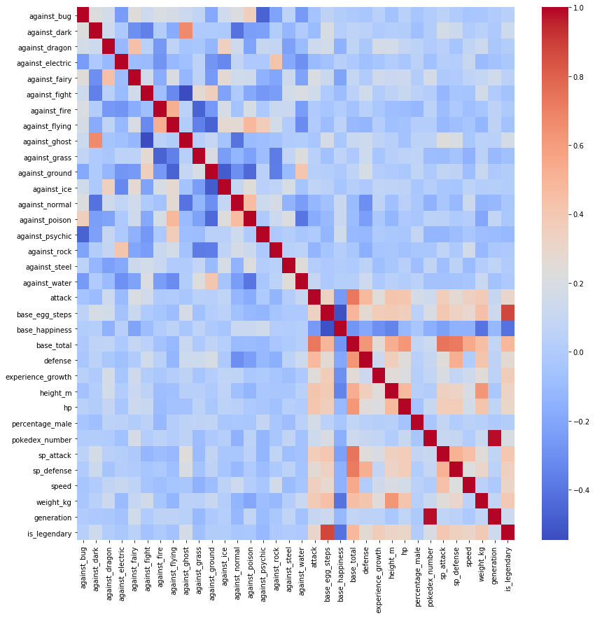
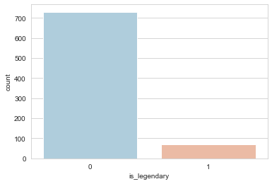
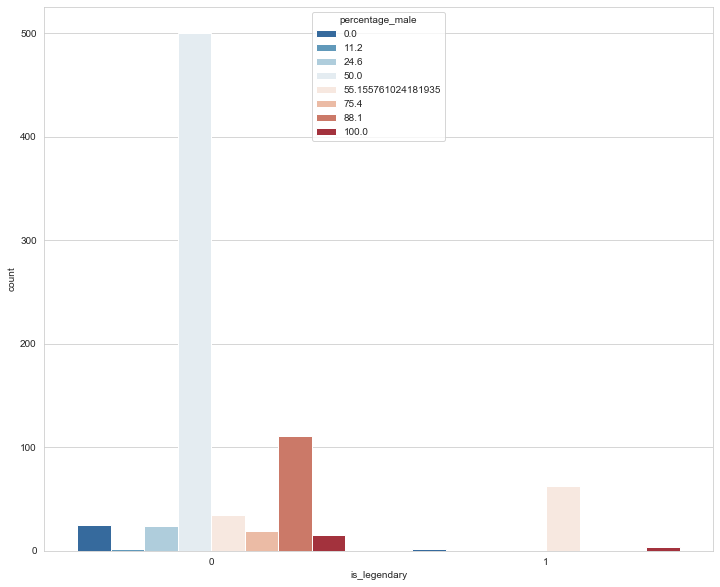
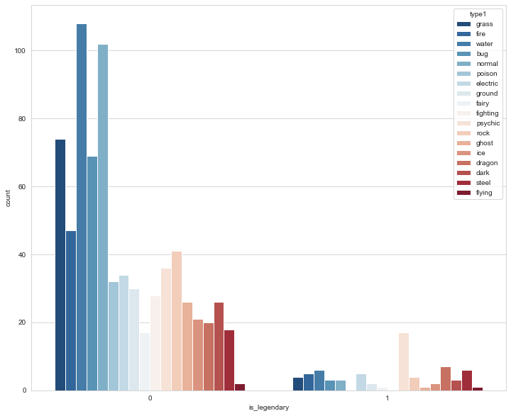
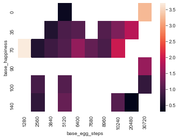
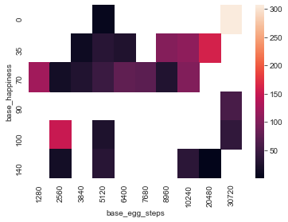
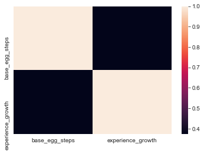
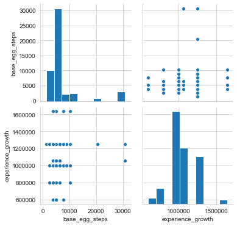

# **PROJECT:- LEGENDARY POKEMON CLASSIFIER**
In this project we have created a *CLASSIFIER* which predicts whether or not a Pokemon
is a **LEGENDARY POKEMON** or not. We have used Machine Learning, specifically LOGISTIC REGRESSION 
for this task. Our choice can be justified as there are only two classes a specific Pokemon can fall into, i.e.
Legendary or Not. Thus a Logistic Regressor is a good option.</br>

### We did our project using Jupyter Notebooks.

The dataset used by contains information on all 802 Pokemon from all Seven Generations of Pokemon. The information contained in this dataset include Base Stats, Performance against Other Types, Height, Weight, Classification, Egg Steps, Experience Points, Abilities, etc. 

## OUR APROACH FOR THIS PROJECT
1).ACQUIRING AND IMPORTING THE DATASET

2).DATA CLEANING

3).DATA VISUALIZATION

4).DATA PREPROCESSING

5).DATA SPLITTING & MODEL SELECTION

6.)MODEL FITTING

7.)PREDICTION

8.)EVALUATION

# STEP 1:-
WE acquired the data from Kaggle as a .csv file. </br>
LINK:- https://www.kaggle.com/rounakbanik/pokemon</br>
</br>
The next step was to import all the necessary libraries like numpy,matplotlib,etc and also import our dataset.</br >


```python
import numpy as np
import pandas as pd
import seaborn as sns
import matplotlib.pyplot as plt
%matplotlib inline
```


```python
df=pd.read_csv('pokemon/pokemon.csv')
```


```python
df.head()
```


<div>
<style scoped>
    .dataframe tbody tr th:only-of-type {
        vertical-align: middle;
    }

    .dataframe tbody tr th {
        vertical-align: top;
    }

    .dataframe thead th {
        text-align: right;
    }
</style>
<table border="1" class="dataframe">
  <thead>
    <tr style="text-align: right;">
      <th></th>
      <th>abilities</th>
      <th>against_bug</th>
      <th>against_dark</th>
      <th>against_dragon</th>
      <th>against_electric</th>
      <th>against_fairy</th>
      <th>against_fight</th>
      <th>against_fire</th>
      <th>against_flying</th>
      <th>against_ghost</th>
      <th>...</th>
      <th>percentage_male</th>
      <th>pokedex_number</th>
      <th>sp_attack</th>
      <th>sp_defense</th>
      <th>speed</th>
      <th>type1</th>
      <th>type2</th>
      <th>weight_kg</th>
      <th>generation</th>
      <th>is_legendary</th>
    </tr>
  </thead>
  <tbody>
    <tr>
      <th>0</th>
      <td>['Overgrow', 'Chlorophyll']</td>
      <td>1.0</td>
      <td>1.0</td>
      <td>1.0</td>
      <td>0.5</td>
      <td>0.5</td>
      <td>0.5</td>
      <td>2.0</td>
      <td>2.0</td>
      <td>1.0</td>
      <td>...</td>
      <td>88.1</td>
      <td>1</td>
      <td>65</td>
      <td>65</td>
      <td>45</td>
      <td>grass</td>
      <td>poison</td>
      <td>6.9</td>
      <td>1</td>
      <td>0</td>
    </tr>
    <tr>
      <th>1</th>
      <td>['Overgrow', 'Chlorophyll']</td>
      <td>1.0</td>
      <td>1.0</td>
      <td>1.0</td>
      <td>0.5</td>
      <td>0.5</td>
      <td>0.5</td>
      <td>2.0</td>
      <td>2.0</td>
      <td>1.0</td>
      <td>...</td>
      <td>88.1</td>
      <td>2</td>
      <td>80</td>
      <td>80</td>
      <td>60</td>
      <td>grass</td>
      <td>poison</td>
      <td>13.0</td>
      <td>1</td>
      <td>0</td>
    </tr>
    <tr>
      <th>2</th>
      <td>['Overgrow', 'Chlorophyll']</td>
      <td>1.0</td>
      <td>1.0</td>
      <td>1.0</td>
      <td>0.5</td>
      <td>0.5</td>
      <td>0.5</td>
      <td>2.0</td>
      <td>2.0</td>
      <td>1.0</td>
      <td>...</td>
      <td>88.1</td>
      <td>3</td>
      <td>122</td>
      <td>120</td>
      <td>80</td>
      <td>grass</td>
      <td>poison</td>
      <td>100.0</td>
      <td>1</td>
      <td>0</td>
    </tr>
    <tr>
      <th>3</th>
      <td>['Blaze', 'Solar Power']</td>
      <td>0.5</td>
      <td>1.0</td>
      <td>1.0</td>
      <td>1.0</td>
      <td>0.5</td>
      <td>1.0</td>
      <td>0.5</td>
      <td>1.0</td>
      <td>1.0</td>
      <td>...</td>
      <td>88.1</td>
      <td>4</td>
      <td>60</td>
      <td>50</td>
      <td>65</td>
      <td>fire</td>
      <td>NaN</td>
      <td>8.5</td>
      <td>1</td>
      <td>0</td>
    </tr>
    <tr>
      <th>4</th>
      <td>['Blaze', 'Solar Power']</td>
      <td>0.5</td>
      <td>1.0</td>
      <td>1.0</td>
      <td>1.0</td>
      <td>0.5</td>
      <td>1.0</td>
      <td>0.5</td>
      <td>1.0</td>
      <td>1.0</td>
      <td>...</td>
      <td>88.1</td>
      <td>5</td>
      <td>80</td>
      <td>65</td>
      <td>80</td>
      <td>fire</td>
      <td>NaN</td>
      <td>19.0</td>
      <td>1</td>
      <td>0</td>
    </tr>
  </tbody>
</table>
<p>5 rows × 41 columns</p>
</div>


```python
df.info()
```

    <class 'pandas.core.frame.DataFrame'>
    RangeIndex: 801 entries, 0 to 800
    Data columns (total 41 columns):
     #   Column             Non-Null Count  Dtype  
    ---  ------             --------------  -----  
     0   abilities          801 non-null    object 
     1   against_bug        801 non-null    float64
     2   against_dark       801 non-null    float64
     3   against_dragon     801 non-null    float64
     4   against_electric   801 non-null    float64
     5   against_fairy      801 non-null    float64
     6   against_fight      801 non-null    float64
     7   against_fire       801 non-null    float64
     8   against_flying     801 non-null    float64
     9   against_ghost      801 non-null    float64
     10  against_grass      801 non-null    float64
     11  against_ground     801 non-null    float64
     12  against_ice        801 non-null    float64
     13  against_normal     801 non-null    float64
     14  against_poison     801 non-null    float64
     15  against_psychic    801 non-null    float64
     16  against_rock       801 non-null    float64
     17  against_steel      801 non-null    float64
     18  against_water      801 non-null    float64
     19  attack             801 non-null    int64  
     20  base_egg_steps     801 non-null    int64  
     21  base_happiness     801 non-null    int64  
     22  base_total         801 non-null    int64  
     23  capture_rate       801 non-null    object 
     24  classfication      801 non-null    object 
     25  defense            801 non-null    int64  
     26  experience_growth  801 non-null    int64  
     27  height_m           781 non-null    float64
     28  hp                 801 non-null    int64  
     29  japanese_name      801 non-null    object 
     30  name               801 non-null    object 
     31  percentage_male    703 non-null    float64
     32  pokedex_number     801 non-null    int64  
     33  sp_attack          801 non-null    int64  
     34  sp_defense         801 non-null    int64  
     35  speed              801 non-null    int64  
     36  type1              801 non-null    object 
     37  type2              417 non-null    object 
     38  weight_kg          781 non-null    float64
     39  generation         801 non-null    int64  
     40  is_legendary       801 non-null    int64  
    dtypes: float64(21), int64(13), object(7)
    memory usage: 256.7+ KB
    
# STEP 2:-
The second step in our project was to clean the data. In this step we check if there are any null values present in the dataset 
or if there is some data present that ought not be there.For this we did the following.</br>

## CHECKING FOR NULL VALUES


```python
fig=plt.figure(figsize=(12,10))
sns.heatmap(df.isnull(),yticklabels=False,cmap='viridis')
```


    <matplotlib.axes._subplots.AxesSubplot at 0x1f9ebbcf0c8>


```python
df.nunique()
```


    abilities            482
    against_bug            5
    against_dark           5
    against_dragon         4
    against_electric       6
    against_fairy          5
    against_fight          6
    against_fire           5
    against_flying         5
    against_ghost          5
    against_grass          5
    against_ground         6
    against_ice            5
    against_normal         4
    against_poison         6
    against_psychic        6
    against_rock           5
    against_steel          5
    against_water          5
    attack               114
    base_egg_steps        10
    base_happiness         6
    base_total           203
    capture_rate          34
    classfication        588
    defense              109
    experience_growth      6
    height_m              51
    hp                    99
    japanese_name        801
    name                 801
    percentage_male        7
    pokedex_number       801
    sp_attack            111
    sp_defense            97
    speed                113
    type1                 18
    type2                 18
    weight_kg            421
    generation             7
    is_legendary           2
    dtype: int64


Next part was to fill in the null values with the mean of their respective columns.</br>

FILLING IN THE NULL VALUES WITH MEAN OF THE COLUMN


```python
def set_mean_sex(pm):
    
    if pd.isnull(pm):
        return df['percentage_male'].mean()
    else:
        
        return pm
        
```


```python
df['percentage_male']=df['percentage_male'].apply(set_mean_sex)
```


```python
def set_mean_height(pm):
    
    if pd.isnull(pm):
        return df['height_m'].mean()
    else:
        
        return pm
```


```python
df['height_m']=df['height_m'].apply(set_mean_height)
```


```python
def set_mean_weight(pm):
    
    if pd.isnull(pm):
        return df['weight_kg'].mean()
    else:
        
        return pm
```


```python
df['weight_kg']=df['weight_kg'].apply(set_mean_weight)
```


```python

```

DROPPING THE "type2" column as it had many Null Values


```python
df.drop('type2',axis=1,inplace=True)
```

## OUR DATA IS NOW CLEAN


```python
fig=plt.figure(figsize=(12,10))
sns.heatmap(df.isnull(),yticklabels=False,cmap='viridis')
```


    <matplotlib.axes._subplots.AxesSubplot at 0x1f9ec619888>


# STEP 3:-

# EXPOLATORY  DATA   ANALYSIS


```python
fig=plt.figure(figsize=(14,14))
sns.heatmap(df.corr(),cmap='coolwarm',annot=False)

```


    <matplotlib.axes._subplots.AxesSubplot at 0x1f9ed915508>





```python
sns.set_style('whitegrid')
sns.countplot(x='is_legendary',data=df,palette='RdBu_r')
```


    <matplotlib.axes._subplots.AxesSubplot at 0x1f9edc57a48>





# HOW DOES MASCULANITY AFFECTS THE POKEMON'S CHANCE OF BEING LEGENDARY


```python
#HOW DOES MASCULANITY EFFECT THE POKEMON'S CHANCE OF BEING LEGENDARY
sns.set_style('whitegrid')
fig=plt.figure(figsize=(12,10))
sns.countplot(x='is_legendary',data=df,hue='percentage_male',palette='RdBu_r')
```


    <matplotlib.axes._subplots.AxesSubplot at 0x1f9efec48c8>





# WHICH TYPE OF POKEMON HAS THE MOST CHANCES TO BECOME LEGENDARY


```python

sns.set_style('whitegrid')
fig=plt.figure(figsize=(12,10))
sns.countplot(x='is_legendary',data=df,hue='type1',palette='RdBu_r')
```


    <matplotlib.axes._subplots.AxesSubplot at 0x1f9eff3b208>





CORRELATION BETWEEN HEIGHT, WEIGHT AND BASE HAPPINESS OF THE POKEMONS


```python
corr = df.pivot_table(values='height_m',index='base_happiness',columns='base_egg_steps')
sns.heatmap(corr)
```


    <matplotlib.axes._subplots.AxesSubplot at 0x1f9f04a4708>





```python
corr = df.pivot_table(values='weight_kg',index='base_happiness',columns='base_egg_steps')
sns.heatmap(corr)
```


    <matplotlib.axes._subplots.AxesSubplot at 0x1f9f0567508>





RELATION BETWEEN EGG STEPS AND EXPERIENCE GROWTH


```python

data=df[['base_egg_steps','experience_growth']]
correlation=data.corr()
sns.heatmap(correlation)
```


    <matplotlib.axes._subplots.AxesSubplot at 0x1f9f056de88>





```python
rel=['base_egg_steps','experience_growth']
sns.pairplot(df,vars=rel)
```


    <seaborn.axisgrid.PairGrid at 0x1f9f0672688>





# STEP 4:-

# DATA  PREPROCESSING

 ADDING DUMMY VARIABLES AND DROPPING SOME COLUMNS


```python
#ADDING DUMMY VARIABLES SO THAT WE CAN PERFORM LOGISTIC REGRESSION
type1 = pd.get_dummies(df['type1'],drop_first=True)

```


```python
df.drop(['abilities','capture_rate','classfication','japanese_name','name','type1'],axis=1,inplace=True)
```


```python
df = pd.concat([df,type1],axis=1)
```


```python

```


```python
df.info()
```

    <class 'pandas.core.frame.DataFrame'>
    RangeIndex: 801 entries, 0 to 800
    Data columns (total 51 columns):
     #   Column             Non-Null Count  Dtype  
    ---  ------             --------------  -----  
     0   against_bug        801 non-null    float64
     1   against_dark       801 non-null    float64
     2   against_dragon     801 non-null    float64
     3   against_electric   801 non-null    float64
     4   against_fairy      801 non-null    float64
     5   against_fight      801 non-null    float64
     6   against_fire       801 non-null    float64
     7   against_flying     801 non-null    float64
     8   against_ghost      801 non-null    float64
     9   against_grass      801 non-null    float64
     10  against_ground     801 non-null    float64
     11  against_ice        801 non-null    float64
     12  against_normal     801 non-null    float64
     13  against_poison     801 non-null    float64
     14  against_psychic    801 non-null    float64
     15  against_rock       801 non-null    float64
     16  against_steel      801 non-null    float64
     17  against_water      801 non-null    float64
     18  attack             801 non-null    int64  
     19  base_egg_steps     801 non-null    int64  
     20  base_happiness     801 non-null    int64  
     21  base_total         801 non-null    int64  
     22  defense            801 non-null    int64  
     23  experience_growth  801 non-null    int64  
     24  height_m           801 non-null    float64
     25  hp                 801 non-null    int64  
     26  percentage_male    801 non-null    float64
     27  pokedex_number     801 non-null    int64  
     28  sp_attack          801 non-null    int64  
     29  sp_defense         801 non-null    int64  
     30  speed              801 non-null    int64  
     31  weight_kg          801 non-null    float64
     32  generation         801 non-null    int64  
     33  is_legendary       801 non-null    int64  
     34  dark               801 non-null    uint8  
     35  dragon             801 non-null    uint8  
     36  electric           801 non-null    uint8  
     37  fairy              801 non-null    uint8  
     38  fighting           801 non-null    uint8  
     39  fire               801 non-null    uint8  
     40  flying             801 non-null    uint8  
     41  ghost              801 non-null    uint8  
     42  grass              801 non-null    uint8  
     43  ground             801 non-null    uint8  
     44  ice                801 non-null    uint8  
     45  normal             801 non-null    uint8  
     46  poison             801 non-null    uint8  
     47  psychic            801 non-null    uint8  
     48  rock               801 non-null    uint8  
     49  steel              801 non-null    uint8  
     50  water              801 non-null    uint8  
    dtypes: float64(21), int64(13), uint8(17)
    memory usage: 226.2 KB
    


# THE LEGENDARY POKEMON CLASSIFIER

# STEP 5:-
### DATA SPLITTING & MODEL SELECTION

TRAIN TEST SPLIT


```python
from sklearn.model_selection import train_test_split
```


```python
X_train, X_test, y_train, y_test = train_test_split(df.drop('is_legendary',axis=1), 
                                                    df['is_legendary'], test_size=0.30, 
                                                    random_state=101)
```


```python
from sklearn.linear_model import LogisticRegression
```

# STEP 6:-
### MODEL FITTING

```python
logmodel = LogisticRegression()
logmodel.fit(X_train,y_train)
```

    C:\Users\Shivam Shandilya\anaconda3\lib\site-packages\sklearn\linear_model\_logistic.py:940: ConvergenceWarning: lbfgs failed to converge (status=1):
    STOP: TOTAL NO. of ITERATIONS REACHED LIMIT.
    
    Increase the number of iterations (max_iter) or scale the data as shown in:
        https://scikit-learn.org/stable/modules/preprocessing.html
    Please also refer to the documentation for alternative solver options:
        https://scikit-learn.org/stable/modules/linear_model.html#logistic-regression
      extra_warning_msg=_LOGISTIC_SOLVER_CONVERGENCE_MSG)
    


    LogisticRegression(C=1.0, class_weight=None, dual=False, fit_intercept=True,
                       intercept_scaling=1, l1_ratio=None, max_iter=100,
                       multi_class='auto', n_jobs=None, penalty='l2',
                       random_state=None, solver='lbfgs', tol=0.0001, verbose=0,
                       warm_start=False)


# STEP 7:-
### PREDICTION

```python
predictions = logmodel.predict(X_test)
```
# STEP 8:-

### EVALUATION


```python
from sklearn.metrics import classification_report,confusion_matrix
```


```python
print(classification_report(y_test,predictions))
```

                  precision    recall  f1-score   support
    
               0       0.99      1.00      0.99       224
               1       0.94      0.88      0.91        17
    
        accuracy                           0.99       241
       macro avg       0.96      0.94      0.95       241
    weighted avg       0.99      0.99      0.99       241
    
    


```python
print(confusion_matrix(y_test,predictions))
```

    [[223   1]
     [  2  15]]
    

# This is our LEGENDARY CLASSIFIER, with an accuracy of 99 percent.


Below we show our Pokemon Dream Team.
### At last we tried to have some fun and find ourselves a **Pokemon Dream Team.**
 
# POKEMON DREAM TEAM

**DESCRIPTION:-** A team of 6 Pokemons that inflicts the most damage while remaining relatively impervious to any other team of 6 Pokemons.


```python
df=pd.read_csv('pokemon/pokemon.csv')
```


```python
df.head()
```


<div>
<style scoped>
    .dataframe tbody tr th:only-of-type {
        vertical-align: middle;
    }

    .dataframe tbody tr th {
        vertical-align: top;
    }

    .dataframe thead th {
        text-align: right;
    }
</style>
<table border="1" class="dataframe">
  <thead>
    <tr style="text-align: right;">
      <th></th>
      <th>abilities</th>
      <th>against_bug</th>
      <th>against_dark</th>
      <th>against_dragon</th>
      <th>against_electric</th>
      <th>against_fairy</th>
      <th>against_fight</th>
      <th>against_fire</th>
      <th>against_flying</th>
      <th>against_ghost</th>
      <th>...</th>
      <th>percentage_male</th>
      <th>pokedex_number</th>
      <th>sp_attack</th>
      <th>sp_defense</th>
      <th>speed</th>
      <th>type1</th>
      <th>type2</th>
      <th>weight_kg</th>
      <th>generation</th>
      <th>is_legendary</th>
    </tr>
  </thead>
  <tbody>
    <tr>
      <th>0</th>
      <td>['Overgrow', 'Chlorophyll']</td>
      <td>1.0</td>
      <td>1.0</td>
      <td>1.0</td>
      <td>0.5</td>
      <td>0.5</td>
      <td>0.5</td>
      <td>2.0</td>
      <td>2.0</td>
      <td>1.0</td>
      <td>...</td>
      <td>88.1</td>
      <td>1</td>
      <td>65</td>
      <td>65</td>
      <td>45</td>
      <td>grass</td>
      <td>poison</td>
      <td>6.9</td>
      <td>1</td>
      <td>0</td>
    </tr>
    <tr>
      <th>1</th>
      <td>['Overgrow', 'Chlorophyll']</td>
      <td>1.0</td>
      <td>1.0</td>
      <td>1.0</td>
      <td>0.5</td>
      <td>0.5</td>
      <td>0.5</td>
      <td>2.0</td>
      <td>2.0</td>
      <td>1.0</td>
      <td>...</td>
      <td>88.1</td>
      <td>2</td>
      <td>80</td>
      <td>80</td>
      <td>60</td>
      <td>grass</td>
      <td>poison</td>
      <td>13.0</td>
      <td>1</td>
      <td>0</td>
    </tr>
    <tr>
      <th>2</th>
      <td>['Overgrow', 'Chlorophyll']</td>
      <td>1.0</td>
      <td>1.0</td>
      <td>1.0</td>
      <td>0.5</td>
      <td>0.5</td>
      <td>0.5</td>
      <td>2.0</td>
      <td>2.0</td>
      <td>1.0</td>
      <td>...</td>
      <td>88.1</td>
      <td>3</td>
      <td>122</td>
      <td>120</td>
      <td>80</td>
      <td>grass</td>
      <td>poison</td>
      <td>100.0</td>
      <td>1</td>
      <td>0</td>
    </tr>
    <tr>
      <th>3</th>
      <td>['Blaze', 'Solar Power']</td>
      <td>0.5</td>
      <td>1.0</td>
      <td>1.0</td>
      <td>1.0</td>
      <td>0.5</td>
      <td>1.0</td>
      <td>0.5</td>
      <td>1.0</td>
      <td>1.0</td>
      <td>...</td>
      <td>88.1</td>
      <td>4</td>
      <td>60</td>
      <td>50</td>
      <td>65</td>
      <td>fire</td>
      <td>NaN</td>
      <td>8.5</td>
      <td>1</td>
      <td>0</td>
    </tr>
    <tr>
      <th>4</th>
      <td>['Blaze', 'Solar Power']</td>
      <td>0.5</td>
      <td>1.0</td>
      <td>1.0</td>
      <td>1.0</td>
      <td>0.5</td>
      <td>1.0</td>
      <td>0.5</td>
      <td>1.0</td>
      <td>1.0</td>
      <td>...</td>
      <td>88.1</td>
      <td>5</td>
      <td>80</td>
      <td>65</td>
      <td>80</td>
      <td>fire</td>
      <td>NaN</td>
      <td>19.0</td>
      <td>1</td>
      <td>0</td>
    </tr>
  </tbody>
</table>
<p>5 rows × 41 columns</p>
</div>


```python
df.info()
```

    <class 'pandas.core.frame.DataFrame'>
    RangeIndex: 801 entries, 0 to 800
    Data columns (total 41 columns):
     #   Column             Non-Null Count  Dtype  
    ---  ------             --------------  -----  
     0   abilities          801 non-null    object 
     1   against_bug        801 non-null    float64
     2   against_dark       801 non-null    float64
     3   against_dragon     801 non-null    float64
     4   against_electric   801 non-null    float64
     5   against_fairy      801 non-null    float64
     6   against_fight      801 non-null    float64
     7   against_fire       801 non-null    float64
     8   against_flying     801 non-null    float64
     9   against_ghost      801 non-null    float64
     10  against_grass      801 non-null    float64
     11  against_ground     801 non-null    float64
     12  against_ice        801 non-null    float64
     13  against_normal     801 non-null    float64
     14  against_poison     801 non-null    float64
     15  against_psychic    801 non-null    float64
     16  against_rock       801 non-null    float64
     17  against_steel      801 non-null    float64
     18  against_water      801 non-null    float64
     19  attack             801 non-null    int64  
     20  base_egg_steps     801 non-null    int64  
     21  base_happiness     801 non-null    int64  
     22  base_total         801 non-null    int64  
     23  capture_rate       801 non-null    object 
     24  classfication      801 non-null    object 
     25  defense            801 non-null    int64  
     26  experience_growth  801 non-null    int64  
     27  height_m           781 non-null    float64
     28  hp                 801 non-null    int64  
     29  japanese_name      801 non-null    object 
     30  name               801 non-null    object 
     31  percentage_male    703 non-null    float64
     32  pokedex_number     801 non-null    int64  
     33  sp_attack          801 non-null    int64  
     34  sp_defense         801 non-null    int64  
     35  speed              801 non-null    int64  
     36  type1              801 non-null    object 
     37  type2              417 non-null    object 
     38  weight_kg          781 non-null    float64
     39  generation         801 non-null    int64  
     40  is_legendary       801 non-null    int64  
    dtypes: float64(21), int64(13), object(7)
    memory usage: 256.7+ KB
    


```python
tmp=df[['attack','defense','sp_attack','sp_defense']]
```


```python
tmp
```


<div>
<style scoped>
    .dataframe tbody tr th:only-of-type {
        vertical-align: middle;
    }

    .dataframe tbody tr th {
        vertical-align: top;
    }

    .dataframe thead th {
        text-align: right;
    }
</style>
<table border="1" class="dataframe">
  <thead>
    <tr style="text-align: right;">
      <th></th>
      <th>attack</th>
      <th>defense</th>
      <th>sp_attack</th>
      <th>sp_defense</th>
    </tr>
  </thead>
  <tbody>
    <tr>
      <th>0</th>
      <td>49</td>
      <td>49</td>
      <td>65</td>
      <td>65</td>
    </tr>
    <tr>
      <th>1</th>
      <td>62</td>
      <td>63</td>
      <td>80</td>
      <td>80</td>
    </tr>
    <tr>
      <th>2</th>
      <td>100</td>
      <td>123</td>
      <td>122</td>
      <td>120</td>
    </tr>
    <tr>
      <th>3</th>
      <td>52</td>
      <td>43</td>
      <td>60</td>
      <td>50</td>
    </tr>
    <tr>
      <th>4</th>
      <td>64</td>
      <td>58</td>
      <td>80</td>
      <td>65</td>
    </tr>
    <tr>
      <th>...</th>
      <td>...</td>
      <td>...</td>
      <td>...</td>
      <td>...</td>
    </tr>
    <tr>
      <th>796</th>
      <td>101</td>
      <td>103</td>
      <td>107</td>
      <td>101</td>
    </tr>
    <tr>
      <th>797</th>
      <td>181</td>
      <td>131</td>
      <td>59</td>
      <td>31</td>
    </tr>
    <tr>
      <th>798</th>
      <td>101</td>
      <td>53</td>
      <td>97</td>
      <td>53</td>
    </tr>
    <tr>
      <th>799</th>
      <td>107</td>
      <td>101</td>
      <td>127</td>
      <td>89</td>
    </tr>
    <tr>
      <th>800</th>
      <td>95</td>
      <td>115</td>
      <td>130</td>
      <td>115</td>
    </tr>
  </tbody>
</table>
<p>801 rows × 4 columns</p>
</div>


```python
total=tmp['attack']+tmp['defense']+tmp['sp_attack']+tmp['sp_defense']
```


```python
d={'Total':total}
```


```python
Total=pd.DataFrame(d)
```


```python
Total
```


<div>
<style scoped>
    .dataframe tbody tr th:only-of-type {
        vertical-align: middle;
    }

    .dataframe tbody tr th {
        vertical-align: top;
    }

    .dataframe thead th {
        text-align: right;
    }
</style>
<table border="1" class="dataframe">
  <thead>
    <tr style="text-align: right;">
      <th></th>
      <th>Total</th>
    </tr>
  </thead>
  <tbody>
    <tr>
      <th>0</th>
      <td>228</td>
    </tr>
    <tr>
      <th>1</th>
      <td>285</td>
    </tr>
    <tr>
      <th>2</th>
      <td>465</td>
    </tr>
    <tr>
      <th>3</th>
      <td>205</td>
    </tr>
    <tr>
      <th>4</th>
      <td>267</td>
    </tr>
    <tr>
      <th>...</th>
      <td>...</td>
    </tr>
    <tr>
      <th>796</th>
      <td>412</td>
    </tr>
    <tr>
      <th>797</th>
      <td>402</td>
    </tr>
    <tr>
      <th>798</th>
      <td>304</td>
    </tr>
    <tr>
      <th>799</th>
      <td>424</td>
    </tr>
    <tr>
      <th>800</th>
      <td>455</td>
    </tr>
  </tbody>
</table>
<p>801 rows × 1 columns</p>
</div>


```python
tmp=pd.concat([tmp,Total],axis=1)
```


```python
tmp
```


<div>
<style scoped>
    .dataframe tbody tr th:only-of-type {
        vertical-align: middle;
    }

    .dataframe tbody tr th {
        vertical-align: top;
    }

    .dataframe thead th {
        text-align: right;
    }
</style>
<table border="1" class="dataframe">
  <thead>
    <tr style="text-align: right;">
      <th></th>
      <th>attack</th>
      <th>defense</th>
      <th>sp_attack</th>
      <th>sp_defense</th>
      <th>Total</th>
    </tr>
  </thead>
  <tbody>
    <tr>
      <th>0</th>
      <td>49</td>
      <td>49</td>
      <td>65</td>
      <td>65</td>
      <td>228</td>
    </tr>
    <tr>
      <th>1</th>
      <td>62</td>
      <td>63</td>
      <td>80</td>
      <td>80</td>
      <td>285</td>
    </tr>
    <tr>
      <th>2</th>
      <td>100</td>
      <td>123</td>
      <td>122</td>
      <td>120</td>
      <td>465</td>
    </tr>
    <tr>
      <th>3</th>
      <td>52</td>
      <td>43</td>
      <td>60</td>
      <td>50</td>
      <td>205</td>
    </tr>
    <tr>
      <th>4</th>
      <td>64</td>
      <td>58</td>
      <td>80</td>
      <td>65</td>
      <td>267</td>
    </tr>
    <tr>
      <th>...</th>
      <td>...</td>
      <td>...</td>
      <td>...</td>
      <td>...</td>
      <td>...</td>
    </tr>
    <tr>
      <th>796</th>
      <td>101</td>
      <td>103</td>
      <td>107</td>
      <td>101</td>
      <td>412</td>
    </tr>
    <tr>
      <th>797</th>
      <td>181</td>
      <td>131</td>
      <td>59</td>
      <td>31</td>
      <td>402</td>
    </tr>
    <tr>
      <th>798</th>
      <td>101</td>
      <td>53</td>
      <td>97</td>
      <td>53</td>
      <td>304</td>
    </tr>
    <tr>
      <th>799</th>
      <td>107</td>
      <td>101</td>
      <td>127</td>
      <td>89</td>
      <td>424</td>
    </tr>
    <tr>
      <th>800</th>
      <td>95</td>
      <td>115</td>
      <td>130</td>
      <td>115</td>
      <td>455</td>
    </tr>
  </tbody>
</table>
<p>801 rows × 5 columns</p>
</div>


```python
df=pd.concat([df,Total],axis=1)
```


```python
fin=df.nlargest(6, ['Total'])
```


```python
fin.info()
```

    <class 'pandas.core.frame.DataFrame'>
    Int64Index: 6 entries, 381 to 149
    Data columns (total 42 columns):
     #   Column             Non-Null Count  Dtype  
    ---  ------             --------------  -----  
     0   abilities          6 non-null      object 
     1   against_bug        6 non-null      float64
     2   against_dark       6 non-null      float64
     3   against_dragon     6 non-null      float64
     4   against_electric   6 non-null      float64
     5   against_fairy      6 non-null      float64
     6   against_fight      6 non-null      float64
     7   against_fire       6 non-null      float64
     8   against_flying     6 non-null      float64
     9   against_ghost      6 non-null      float64
     10  against_grass      6 non-null      float64
     11  against_ground     6 non-null      float64
     12  against_ice        6 non-null      float64
     13  against_normal     6 non-null      float64
     14  against_poison     6 non-null      float64
     15  against_psychic    6 non-null      float64
     16  against_rock       6 non-null      float64
     17  against_steel      6 non-null      float64
     18  against_water      6 non-null      float64
     19  attack             6 non-null      int64  
     20  base_egg_steps     6 non-null      int64  
     21  base_happiness     6 non-null      int64  
     22  base_total         6 non-null      int64  
     23  capture_rate       6 non-null      object 
     24  classfication      6 non-null      object 
     25  defense            6 non-null      int64  
     26  experience_growth  6 non-null      int64  
     27  height_m           6 non-null      float64
     28  hp                 6 non-null      int64  
     29  japanese_name      6 non-null      object 
     30  name               6 non-null      object 
     31  percentage_male    1 non-null      float64
     32  pokedex_number     6 non-null      int64  
     33  sp_attack          6 non-null      int64  
     34  sp_defense         6 non-null      int64  
     35  speed              6 non-null      int64  
     36  type1              6 non-null      object 
     37  type2              2 non-null      object 
     38  weight_kg          6 non-null      float64
     39  generation         6 non-null      int64  
     40  is_legendary       6 non-null      int64  
     41  Total              6 non-null      int64  
    dtypes: float64(21), int64(14), object(7)
    memory usage: 2.0+ KB
    


```python
dream_team=fin[['name','japanese_name','pokedex_number','type1','attack','defense','sp_attack','sp_defense','Total']]
```


```python
dream_team.set_index('type1')
```


<div>
<style scoped>
    .dataframe tbody tr th:only-of-type {
        vertical-align: middle;
    }

    .dataframe tbody tr th {
        vertical-align: top;
    }

    .dataframe thead th {
        text-align: right;
    }
</style>
<table border="1" class="dataframe">
  <thead>
    <tr style="text-align: right;">
      <th></th>
      <th>name</th>
      <th>japanese_name</th>
      <th>pokedex_number</th>
      <th>attack</th>
      <th>defense</th>
      <th>sp_attack</th>
      <th>sp_defense</th>
      <th>Total</th>
    </tr>
    <tr>
      <th>type1</th>
      <th></th>
      <th></th>
      <th></th>
      <th></th>
      <th></th>
      <th></th>
      <th></th>
      <th></th>
    </tr>
  </thead>
  <tbody>
    <tr>
      <th>water</th>
      <td>Kyogre</td>
      <td>Kyogreカイオーガ</td>
      <td>382</td>
      <td>150</td>
      <td>90</td>
      <td>180</td>
      <td>160</td>
      <td>580</td>
    </tr>
    <tr>
      <th>ground</th>
      <td>Groudon</td>
      <td>Groudonグラードン</td>
      <td>383</td>
      <td>180</td>
      <td>160</td>
      <td>150</td>
      <td>90</td>
      <td>580</td>
    </tr>
    <tr>
      <th>dragon</th>
      <td>Rayquaza</td>
      <td>Rayquazaレックウザ</td>
      <td>384</td>
      <td>180</td>
      <td>100</td>
      <td>180</td>
      <td>100</td>
      <td>560</td>
    </tr>
    <tr>
      <th>water</th>
      <td>Wishiwashi</td>
      <td>Yowashi (tandoku No Sugata)ヨワシ</td>
      <td>746</td>
      <td>140</td>
      <td>130</td>
      <td>140</td>
      <td>135</td>
      <td>545</td>
    </tr>
    <tr>
      <th>rock</th>
      <td>Diancie</td>
      <td>Diancieディアンシー</td>
      <td>719</td>
      <td>160</td>
      <td>110</td>
      <td>160</td>
      <td>110</td>
      <td>540</td>
    </tr>
    <tr>
      <th>psychic</th>
      <td>Mewtwo</td>
      <td>Mewtwoミュウツー</td>
      <td>150</td>
      <td>150</td>
      <td>70</td>
      <td>194</td>
      <td>120</td>
      <td>534</td>
    </tr>
  </tbody>
</table>
</div>


THIS IS OUR POKEMON DREAM TEAM.


# WORK DONE BY TEAM:- V FOR VENDETTA.
<br>
<strong>
<a href="https://github.com/shivamshan">SHIVAM SHANDILYA</a>
</strong>
</br>
<br>
<strong>
<a href="https://github.com/Shritam-jpg">SHRITAM SAIN</a>
</strong>
</br>
<br>
<strong>
<a href="https://github.com/Arpita-314">ARPITA</a>
</strong>
</br>


