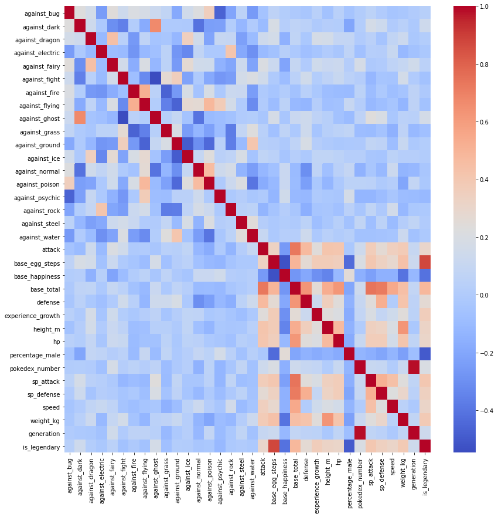
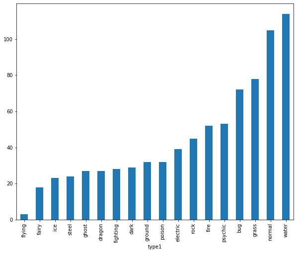
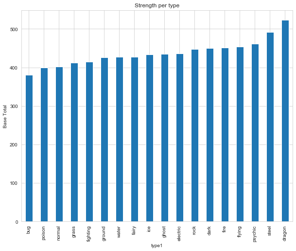
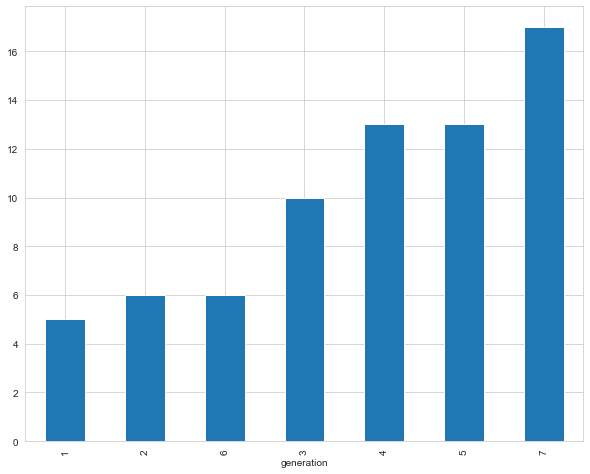
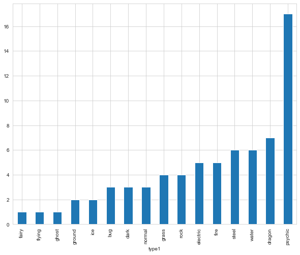

# **PROJECT:- LEGENDARY POKEMON CLASSIFIER**
In this project we have created a *CLASSIFIER* which predicts whether or not a Pokemon
is a **LEGENDARY POKEMON** or not. We have used Machine Learning, specifically LOGISTIC REGRESSION 
for this task. Our choice can be justified as there are only two classes a specific Pokemon can fall into, i.e.
Legendary or Not. Thus a Logistic Regressor is a good option.</br>

### We did our project using Jupyter Notebooks.

The dataset used by contains information on all 802 Pokemon from all Seven Generations of Pokemon. The information contained in this dataset include Base Stats, Performance against Other Types, Height, Weight, Classification, Egg Steps, Experience Points, Abilities, etc. 

### Content
#### name: The English name of the Pokemon
#### japanese_name: The Original Japanese name of the Pokemon
#### pokedex_number: The entry number of the Pokemon in the National Pokedex
#### percentage_male: The percentage of the species that are male. Blank if the Pokemon is genderless.
#### type1: The Primary Type of the Pokemon
#### type2: The Secondary Type of the Pokemon
#### classification: The Classification of the Pokemon as described by the Sun and Moon Pokedex
#### height_m: Height of the Pokemon in metres
#### weight_kg: The Weight of the Pokemon in kilograms
#### capture_rate: Capture Rate of the Pokemon
#### baseeggsteps: The number of steps required to hatch an egg of the Pokemon
#### abilities: A stringified list of abilities that the Pokemon is capable of having
#### experience_growth: The Experience Growth of the Pokemon
#### base_happiness: Base Happiness of the Pokemon
#### against_: Eighteen features that denote the amount of damage taken against an attack of a particular type
#### hp: The Base HP of the Pokemon
#### attack: The Base Attack of the Pokemon
#### defense: The Base Defense of the Pokemon
#### sp_attack: The Base Special Attack of the Pokemon
#### sp_defense: The Base Special Defense of the Pokemon
#### speed: The Base Speed of the Pokemon
#### generation: The numbered generation which the Pokemon was first introduced
#### is_legendary: Denotes if the Pokemon is legendary.

## OUR APROACH FOR THIS PROJECT
1).ACQUIRING AND IMPORTING THE DATASET

2).DATA CLEANING

3).DATA VISUALIZATION

4).DATA PREPROCESSING

5).DATA SPLITTING & MODEL SELECTION

6.)MODEL FITTING

7.)PREDICTION

8.)EVALUATION

# STEP 1:-
WE acquired the data from Kaggle as a .csv file. </br>
LINK:- https://www.kaggle.com/rounakbanik/pokemon</br>
</br>
The next step was to import all the necessary libraries like numpy,matplotlib,etc and also import our dataset.</br >

```python
#importing the necessary libraries for data analysis and visualization
import pandas as pd
import numpy as np 
import matplotlib.pyplot as plt
import seaborn as sns
%matplotlib inline
```


```python
#storing the data in the poke_df dataframe 
poke_df= pd.read_csv('C:/Users/Shivam Shandilya/Desktop/pokemon/pokemon.csv')
```


```python
poke_df.info()
```

    <class 'pandas.core.frame.DataFrame'>
    RangeIndex: 801 entries, 0 to 800
    Data columns (total 41 columns):
     #   Column             Non-Null Count  Dtype  
    ---  ------             --------------  -----  
     0   abilities          801 non-null    object 
     1   against_bug        801 non-null    float64
     2   against_dark       801 non-null    float64
     3   against_dragon     801 non-null    float64
     4   against_electric   801 non-null    float64
     5   against_fairy      801 non-null    float64
     6   against_fight      801 non-null    float64
     7   against_fire       801 non-null    float64
     8   against_flying     801 non-null    float64
     9   against_ghost      801 non-null    float64
     10  against_grass      801 non-null    float64
     11  against_ground     801 non-null    float64
     12  against_ice        801 non-null    float64
     13  against_normal     801 non-null    float64
     14  against_poison     801 non-null    float64
     15  against_psychic    801 non-null    float64
     16  against_rock       801 non-null    float64
     17  against_steel      801 non-null    float64
     18  against_water      801 non-null    float64
     19  attack             801 non-null    int64  
     20  base_egg_steps     801 non-null    int64  
     21  base_happiness     801 non-null    int64  
     22  base_total         801 non-null    int64  
     23  capture_rate       801 non-null    object 
     24  classfication      801 non-null    object 
     25  defense            801 non-null    int64  
     26  experience_growth  801 non-null    int64  
     27  height_m           781 non-null    float64
     28  hp                 801 non-null    int64  
     29  japanese_name      801 non-null    object 
     30  name               801 non-null    object 
     31  percentage_male    703 non-null    float64
     32  pokedex_number     801 non-null    int64  
     33  sp_attack          801 non-null    int64  
     34  sp_defense         801 non-null    int64  
     35  speed              801 non-null    int64  
     36  type1              801 non-null    object 
     37  type2              417 non-null    object 
     38  weight_kg          781 non-null    float64
     39  generation         801 non-null    int64  
     40  is_legendary       801 non-null    int64  
    dtypes: float64(21), int64(13), object(7)
    memory usage: 256.7+ KB
    


```python
poke_df.iloc[:,19:].head()
```


<div>
<style scoped>
    .dataframe tbody tr th:only-of-type {
        vertical-align: middle;
    }

    .dataframe tbody tr th {
        vertical-align: top;
    }

    .dataframe thead th {
        text-align: right;
    }
</style>
<table border="1" class="dataframe">
  <thead>
    <tr style="text-align: right;">
      <th></th>
      <th>attack</th>
      <th>base_egg_steps</th>
      <th>base_happiness</th>
      <th>base_total</th>
      <th>capture_rate</th>
      <th>classfication</th>
      <th>defense</th>
      <th>experience_growth</th>
      <th>height_m</th>
      <th>hp</th>
      <th>...</th>
      <th>percentage_male</th>
      <th>pokedex_number</th>
      <th>sp_attack</th>
      <th>sp_defense</th>
      <th>speed</th>
      <th>type1</th>
      <th>type2</th>
      <th>weight_kg</th>
      <th>generation</th>
      <th>is_legendary</th>
    </tr>
  </thead>
  <tbody>
    <tr>
      <th>0</th>
      <td>49</td>
      <td>5120</td>
      <td>70</td>
      <td>318</td>
      <td>45</td>
      <td>Seed Pokémon</td>
      <td>49</td>
      <td>1059860</td>
      <td>0.7</td>
      <td>45</td>
      <td>...</td>
      <td>88.1</td>
      <td>1</td>
      <td>65</td>
      <td>65</td>
      <td>45</td>
      <td>grass</td>
      <td>poison</td>
      <td>6.9</td>
      <td>1</td>
      <td>0</td>
    </tr>
    <tr>
      <th>1</th>
      <td>62</td>
      <td>5120</td>
      <td>70</td>
      <td>405</td>
      <td>45</td>
      <td>Seed Pokémon</td>
      <td>63</td>
      <td>1059860</td>
      <td>1.0</td>
      <td>60</td>
      <td>...</td>
      <td>88.1</td>
      <td>2</td>
      <td>80</td>
      <td>80</td>
      <td>60</td>
      <td>grass</td>
      <td>poison</td>
      <td>13.0</td>
      <td>1</td>
      <td>0</td>
    </tr>
    <tr>
      <th>2</th>
      <td>100</td>
      <td>5120</td>
      <td>70</td>
      <td>625</td>
      <td>45</td>
      <td>Seed Pokémon</td>
      <td>123</td>
      <td>1059860</td>
      <td>2.0</td>
      <td>80</td>
      <td>...</td>
      <td>88.1</td>
      <td>3</td>
      <td>122</td>
      <td>120</td>
      <td>80</td>
      <td>grass</td>
      <td>poison</td>
      <td>100.0</td>
      <td>1</td>
      <td>0</td>
    </tr>
    <tr>
      <th>3</th>
      <td>52</td>
      <td>5120</td>
      <td>70</td>
      <td>309</td>
      <td>45</td>
      <td>Lizard Pokémon</td>
      <td>43</td>
      <td>1059860</td>
      <td>0.6</td>
      <td>39</td>
      <td>...</td>
      <td>88.1</td>
      <td>4</td>
      <td>60</td>
      <td>50</td>
      <td>65</td>
      <td>fire</td>
      <td>NaN</td>
      <td>8.5</td>
      <td>1</td>
      <td>0</td>
    </tr>
    <tr>
      <th>4</th>
      <td>64</td>
      <td>5120</td>
      <td>70</td>
      <td>405</td>
      <td>45</td>
      <td>Flame Pokémon</td>
      <td>58</td>
      <td>1059860</td>
      <td>1.1</td>
      <td>58</td>
      <td>...</td>
      <td>88.1</td>
      <td>5</td>
      <td>80</td>
      <td>65</td>
      <td>80</td>
      <td>fire</td>
      <td>NaN</td>
      <td>19.0</td>
      <td>1</td>
      <td>0</td>
    </tr>
  </tbody>
</table>
<p>5 rows × 22 columns</p>
</div>


# STEP 2:-
The second step in our project was to clean the data. In this step we check if there are any null values present in the dataset 
or if there is some data present that ought not be there.For this we 
did the following.</br>

## CHECKING FOR NULL VALUES


```python
#Finding Out the number of missing/null values
poke_df.isnull().sum()
```


    abilities              0
    against_bug            0
    against_dark           0
    against_dragon         0
    against_electric       0
    against_fairy          0
    against_fight          0
    against_fire           0
    against_flying         0
    against_ghost          0
    against_grass          0
    against_ground         0
    against_ice            0
    against_normal         0
    against_poison         0
    against_psychic        0
    against_rock           0
    against_steel          0
    against_water          0
    attack                 0
    base_egg_steps         0
    base_happiness         0
    base_total             0
    capture_rate           0
    classfication          0
    defense                0
    experience_growth      0
    height_m              20
    hp                     0
    japanese_name          0
    name                   0
    percentage_male       98
    pokedex_number         0
    sp_attack              0
    sp_defense             0
    speed                  0
    type1                  0
    type2                384
    weight_kg             20
    generation             0
    is_legendary           0
    dtype: int64


```python
fig=plt.figure(figsize=(12,10))
sns.heatmap(poke_df.isnull(),yticklabels=False,cmap='viridis')
```


    <matplotlib.axes._subplots.AxesSubplot at 0x293d2d2f408>


Next part was to fill in the null values with the mean of their respective columns.</br>

### Filling the missing height values


```python
#First off, we will find the different primary types of pokemon and group them according to it
poke_df['type1'].unique()
```


    array(['grass', 'fire', 'water', 'bug', 'normal', 'poison', 'electric',
           'ground', 'fairy', 'fighting', 'psychic', 'rock', 'ghost', 'ice',
           'dragon', 'dark', 'steel', 'flying'], dtype=object)


```python
#Finding out the average height of a Pokemon according to its type
mean_height= poke_df.groupby('type1')['height_m'].mean()
mean_height
```


    type1
    bug         0.883333
    dark        1.296552
    dragon      1.937037
    electric    0.981579
    fairy       0.794444
    fighting    1.196429
    fire        1.168000
    flying      1.166667
    ghost       1.251852
    grass       0.938961
    ground      1.340741
    ice         1.208696
    normal      1.024752
    poison      1.160000
    psychic     1.063462
    rock        1.304878
    steel       1.875000
    water       1.283333
    Name: height_m, dtype: float64


```python
#Finding the mean height of a bug type Pokemon
mean_height['bug']
```


    0.8833333333333332


```python
def avg_height (type, height):
    if np.isnan(height):
        return mean_height[type]
    else:
        return height
```


```python
#Now we will fill in the missing height values with the average height of the type of the pokemon it is with the help of avg_height function
poke_df['height_m'] = poke_df.apply(lambda x: avg_height(x.type1, x.height_m), axis=1)
```


```python
#Checking the presence of null values in height_m column
poke_df.isnull().sum()['height_m']
```


    0


### Filling the missing percentage_male values


```python
#Since the genderless pokemons have blank percentage_male values, we will substitute those none values with 0
poke_df['percentage_male']= poke_df['percentage_male'].apply(lambda x: 0 if np.isnan(x) else x)
```


```python
#Checking the presence of null values in percentage_male column
poke_df.isnull().sum()['percentage_male']
```


    0


### Filling the missing weight values


```python
#Finding the average weight per pokemon type
mean_weight = poke_df.groupby('type1')['weight_kg'].mean()
mean_weight
```


    type1
    bug          33.083333
    dark         69.096552
    dragon      107.125926
    electric     37.944737
    fairy        23.555556
    fighting     58.675000
    fire         66.096000
    flying       52.000000
    ghost        69.570370
    grass        33.255844
    ground      150.044444
    ice         103.260870
    normal       46.158416
    poison       33.830000
    psychic      57.328846
    rock         92.946341
    steel       188.841667
    water        51.071930
    Name: weight_kg, dtype: float64


```python
mean_weight['bug']
```


    33.08333333333334


```python
def avg_weight(type, weight):
    if (np.isnan(weight)):
        return mean_weight[type]
    else:
        return weight
```


```python
#Filling the missing values with average weight according to that pokemon's type
poke_df['weight_kg']= poke_df.apply(lambda x: avg_weight(x.type1, x.weight_kg), axis=1)
```


```python
#Checking null values in weight_kg column
poke_df.isnull().sum()['weight_kg']
```


    0


### Dropping the type2 column


```python
#Since there is a large number of type2 data missing, we will drop it. As we have the type1 column, dropping the type2 column won't make a big differnce
poke_df.drop('type2', axis=1, inplace=True)
```


```python
#Checking the cleaned dataset
poke_df.isnull().sum()
```


    abilities            0
    against_bug          0
    against_dark         0
    against_dragon       0
    against_electric     0
    against_fairy        0
    against_fight        0
    against_fire         0
    against_flying       0
    against_ghost        0
    against_grass        0
    against_ground       0
    against_ice          0
    against_normal       0
    against_poison       0
    against_psychic      0
    against_rock         0
    against_steel        0
    against_water        0
    attack               0
    base_egg_steps       0
    base_happiness       0
    base_total           0
    capture_rate         0
    classfication        0
    defense              0
    experience_growth    0
    height_m             0
    hp                   0
    japanese_name        0
    name                 0
    percentage_male      0
    pokedex_number       0
    sp_attack            0
    sp_defense           0
    speed                0
    type1                0
    weight_kg            0
    generation           0
    is_legendary         0
    dtype: int64


# OUR DATA IS NOW CLEAN


```python
fig=plt.figure(figsize=(12,10))
sns.heatmap(poke_df.isnull(),yticklabels=False,cmap='viridis')
```


    <matplotlib.axes._subplots.AxesSubplot at 0x293d2e79cc8>


# STEP 3:-

## EXPOLATORY  DATA   ANALYSIS


```python
fig=plt.figure(figsize=(14,14))
sns.heatmap(poke_df.corr(),cmap='coolwarm',annot=False)

```


    <matplotlib.axes._subplots.AxesSubplot at 0x293d2f9cd08>





#### How does height and weight of a Pokemon correlate with its various base stats?


```python
poke_df.corr()[['height_m', 'weight_kg']]
```


<div>
<style scoped>
    .dataframe tbody tr th:only-of-type {
        vertical-align: middle;
    }

    .dataframe tbody tr th {
        vertical-align: top;
    }

    .dataframe thead th {
        text-align: right;
    }
</style>
<table border="1" class="dataframe">
  <thead>
    <tr style="text-align: right;">
      <th></th>
      <th>height_m</th>
      <th>weight_kg</th>
    </tr>
  </thead>
  <tbody>
    <tr>
      <th>against_bug</th>
      <td>-0.061089</td>
      <td>-0.032426</td>
    </tr>
    <tr>
      <th>against_dark</th>
      <td>0.017138</td>
      <td>0.035865</td>
    </tr>
    <tr>
      <th>against_dragon</th>
      <td>0.164451</td>
      <td>0.126091</td>
    </tr>
    <tr>
      <th>against_electric</th>
      <td>0.000997</td>
      <td>-0.110712</td>
    </tr>
    <tr>
      <th>against_fairy</th>
      <td>0.114907</td>
      <td>0.097847</td>
    </tr>
    <tr>
      <th>against_fight</th>
      <td>0.058836</td>
      <td>0.160718</td>
    </tr>
    <tr>
      <th>against_fire</th>
      <td>-0.086357</td>
      <td>-0.046338</td>
    </tr>
    <tr>
      <th>against_flying</th>
      <td>-0.073466</td>
      <td>-0.128664</td>
    </tr>
    <tr>
      <th>against_ghost</th>
      <td>0.031694</td>
      <td>0.046942</td>
    </tr>
    <tr>
      <th>against_grass</th>
      <td>0.033080</td>
      <td>0.059733</td>
    </tr>
    <tr>
      <th>against_ground</th>
      <td>-0.003275</td>
      <td>0.108444</td>
    </tr>
    <tr>
      <th>against_ice</th>
      <td>0.069709</td>
      <td>0.023752</td>
    </tr>
    <tr>
      <th>against_normal</th>
      <td>-0.074612</td>
      <td>-0.134133</td>
    </tr>
    <tr>
      <th>against_poison</th>
      <td>-0.126556</td>
      <td>-0.207627</td>
    </tr>
    <tr>
      <th>against_psychic</th>
      <td>-0.021304</td>
      <td>-0.088336</td>
    </tr>
    <tr>
      <th>against_rock</th>
      <td>-0.036600</td>
      <td>-0.117532</td>
    </tr>
    <tr>
      <th>against_steel</th>
      <td>-0.027317</td>
      <td>0.019143</td>
    </tr>
    <tr>
      <th>against_water</th>
      <td>0.039178</td>
      <td>0.128078</td>
    </tr>
    <tr>
      <th>attack</th>
      <td>0.419098</td>
      <td>0.378631</td>
    </tr>
    <tr>
      <th>base_egg_steps</th>
      <td>0.376916</td>
      <td>0.435909</td>
    </tr>
    <tr>
      <th>base_happiness</th>
      <td>-0.342481</td>
      <td>-0.402707</td>
    </tr>
    <tr>
      <th>base_total</th>
      <td>0.528701</td>
      <td>0.449731</td>
    </tr>
    <tr>
      <th>defense</th>
      <td>0.359315</td>
      <td>0.421979</td>
    </tr>
    <tr>
      <th>experience_growth</th>
      <td>0.244636</td>
      <td>0.242978</td>
    </tr>
    <tr>
      <th>height_m</th>
      <td>1.000000</td>
      <td>0.626094</td>
    </tr>
    <tr>
      <th>hp</th>
      <td>0.472220</td>
      <td>0.416959</td>
    </tr>
    <tr>
      <th>percentage_male</th>
      <td>-0.145899</td>
      <td>-0.230117</td>
    </tr>
    <tr>
      <th>pokedex_number</th>
      <td>0.007868</td>
      <td>0.113607</td>
    </tr>
    <tr>
      <th>sp_attack</th>
      <td>0.344484</td>
      <td>0.233214</td>
    </tr>
    <tr>
      <th>sp_defense</th>
      <td>0.324026</td>
      <td>0.299618</td>
    </tr>
    <tr>
      <th>speed</th>
      <td>0.198577</td>
      <td>0.050185</td>
    </tr>
    <tr>
      <th>weight_kg</th>
      <td>0.626094</td>
      <td>1.000000</td>
    </tr>
    <tr>
      <th>generation</th>
      <td>-0.025292</td>
      <td>0.077842</td>
    </tr>
    <tr>
      <th>is_legendary</th>
      <td>0.319051</td>
      <td>0.387403</td>
    </tr>
  </tbody>
</table>
</div>


```python
#Heatmap of the most relevant features with respect to the height and weight of the pokemon
plt.figure(figsize=(15,8))
sns.heatmap(poke_df.corr()[['height_m', 'weight_kg']].iloc[18:].drop('pokedex_number'), annot=True, cmap='coolwarm')
```


    <matplotlib.axes._subplots.AxesSubplot at 0x293d32a3c48>


#### What factors influence the Experience Growth and Egg Steps? Are these quantities correlated?


```python
poke_df.corr()[['experience_growth', 'base_egg_steps']].iloc[18:]
```


<div>
<style scoped>
    .dataframe tbody tr th:only-of-type {
        vertical-align: middle;
    }

    .dataframe tbody tr th {
        vertical-align: top;
    }

    .dataframe thead th {
        text-align: right;
    }
</style>
<table border="1" class="dataframe">
  <thead>
    <tr style="text-align: right;">
      <th></th>
      <th>experience_growth</th>
      <th>base_egg_steps</th>
    </tr>
  </thead>
  <tbody>
    <tr>
      <th>attack</th>
      <td>0.241087</td>
      <td>0.331088</td>
    </tr>
    <tr>
      <th>base_egg_steps</th>
      <td>0.373837</td>
      <td>1.000000</td>
    </tr>
    <tr>
      <th>base_happiness</th>
      <td>-0.295348</td>
      <td>-0.524551</td>
    </tr>
    <tr>
      <th>base_total</th>
      <td>0.256930</td>
      <td>0.496466</td>
    </tr>
    <tr>
      <th>defense</th>
      <td>0.129698</td>
      <td>0.265230</td>
    </tr>
    <tr>
      <th>experience_growth</th>
      <td>1.000000</td>
      <td>0.373837</td>
    </tr>
    <tr>
      <th>height_m</th>
      <td>0.244636</td>
      <td>0.376916</td>
    </tr>
    <tr>
      <th>hp</th>
      <td>0.214068</td>
      <td>0.359218</td>
    </tr>
    <tr>
      <th>percentage_male</th>
      <td>-0.172634</td>
      <td>-0.435959</td>
    </tr>
    <tr>
      <th>pokedex_number</th>
      <td>0.084687</td>
      <td>0.197278</td>
    </tr>
    <tr>
      <th>sp_attack</th>
      <td>0.201603</td>
      <td>0.404477</td>
    </tr>
    <tr>
      <th>sp_defense</th>
      <td>0.088806</td>
      <td>0.335404</td>
    </tr>
    <tr>
      <th>speed</th>
      <td>0.144946</td>
      <td>0.289447</td>
    </tr>
    <tr>
      <th>weight_kg</th>
      <td>0.242978</td>
      <td>0.435909</td>
    </tr>
    <tr>
      <th>generation</th>
      <td>0.052530</td>
      <td>0.128941</td>
    </tr>
    <tr>
      <th>is_legendary</th>
      <td>0.361038</td>
      <td>0.873488</td>
    </tr>
  </tbody>
</table>
</div>


# Heatmap of the most relevant features with respect to experience growth and base egg steps


```python

plt.figure(figsize=(15,8))
sns.heatmap(poke_df.corr()[['experience_growth', 'base_egg_steps']].iloc[18:], annot=True, cmap='coolwarm')
```


    <matplotlib.axes._subplots.AxesSubplot at 0x293d55fa688>


### Which type is the strongest overall? Which is the weakest?


```python
#Let's explore the type of pokemons
poke_df.groupby('type1')['type1'].count().sort_values().plot(kind='bar', figsize=(10,8))
```


    <matplotlib.axes._subplots.AxesSubplot at 0x293d5a05f88>





```python
#To determine the strength of a pokemon, we must compare the base_total column
base_type = poke_df.groupby('type1')['base_total'].mean().sort_values()
base_type
```


    type1
    bug         380.430556
    poison      399.562500
    normal      401.295238
    grass       412.576923
    fighting    414.821429
    ground      426.093750
    water       426.789474
    fairy       427.166667
    ice         433.608696
    ghost       434.703704
    electric    436.153846
    rock        447.266667
    dark        449.758621
    fire        450.634615
    flying      453.333333
    psychic     461.264151
    steel       491.583333
    dragon      522.777778
    Name: base_total, dtype: float64


```python
plt.figure(figsize=(10,8))
sns.set_style('whitegrid')
plt.ylabel('Base Total')
plt.title('Strength per type') 
base_type.plot(kind='bar')
```


    <matplotlib.axes._subplots.AxesSubplot at 0x293d5a9da48>





### Which type is the most likely to be a legendary Pokemon?


```python
#Let's explore the legendary pokemons a bit
poke_df['is_legendary'].value_counts().plot(kind='pie',
                                            autopct='%1.1f%%',
                                            labels= ['Normal','Legendary'],
                                            shadow=True,
                                            colors=['orange','blue'],
                                            figsize=(7,7),
                                            startangle=90,
                                            explode=[0,0.1])
```


    <matplotlib.axes._subplots.AxesSubplot at 0x293d5c98408>


```python
poke_df[poke_df['is_legendary']==1].groupby('generation')['is_legendary'].count().sort_values().plot(kind='bar', figsize=(10,8))
```


    <matplotlib.axes._subplots.AxesSubplot at 0x293d5b7a288>





```python
poke_df[poke_df['is_legendary']==1].groupby('type1')['is_legendary'].count().sort_values().plot(kind='bar', figsize=(10,8))
```


    <matplotlib.axes._subplots.AxesSubplot at 0x293d5bfab48>





# STEP 4:-

# DATA  PREPROCESSING

ADDING DUMMY VARIABLES AND DROPPING SOME COLUMNS


```python
#First we need to prepare some columns to feed into the classifier
poke_df.columns
```


    Index(['abilities', 'against_bug', 'against_dark', 'against_dragon',
           'against_electric', 'against_fairy', 'against_fight', 'against_fire',
           'against_flying', 'against_ghost', 'against_grass', 'against_ground',
           'against_ice', 'against_normal', 'against_poison', 'against_psychic',
           'against_rock', 'against_steel', 'against_water', 'attack',
           'base_egg_steps', 'base_happiness', 'base_total', 'capture_rate',
           'classfication', 'defense', 'experience_growth', 'height_m', 'hp',
           'japanese_name', 'name', 'percentage_male', 'pokedex_number',
           'sp_attack', 'sp_defense', 'speed', 'type1', 'weight_kg', 'generation',
           'is_legendary'],
          dtype='object')


```python
poke_df.info()
```

    <class 'pandas.core.frame.DataFrame'>
    RangeIndex: 801 entries, 0 to 800
    Data columns (total 40 columns):
     #   Column             Non-Null Count  Dtype  
    ---  ------             --------------  -----  
     0   abilities          801 non-null    object 
     1   against_bug        801 non-null    float64
     2   against_dark       801 non-null    float64
     3   against_dragon     801 non-null    float64
     4   against_electric   801 non-null    float64
     5   against_fairy      801 non-null    float64
     6   against_fight      801 non-null    float64
     7   against_fire       801 non-null    float64
     8   against_flying     801 non-null    float64
     9   against_ghost      801 non-null    float64
     10  against_grass      801 non-null    float64
     11  against_ground     801 non-null    float64
     12  against_ice        801 non-null    float64
     13  against_normal     801 non-null    float64
     14  against_poison     801 non-null    float64
     15  against_psychic    801 non-null    float64
     16  against_rock       801 non-null    float64
     17  against_steel      801 non-null    float64
     18  against_water      801 non-null    float64
     19  attack             801 non-null    int64  
     20  base_egg_steps     801 non-null    int64  
     21  base_happiness     801 non-null    int64  
     22  base_total         801 non-null    int64  
     23  capture_rate       801 non-null    object 
     24  classfication      801 non-null    object 
     25  defense            801 non-null    int64  
     26  experience_growth  801 non-null    int64  
     27  height_m           801 non-null    float64
     28  hp                 801 non-null    int64  
     29  japanese_name      801 non-null    object 
     30  name               801 non-null    object 
     31  percentage_male    801 non-null    float64
     32  pokedex_number     801 non-null    int64  
     33  sp_attack          801 non-null    int64  
     34  sp_defense         801 non-null    int64  
     35  speed              801 non-null    int64  
     36  type1              801 non-null    object 
     37  weight_kg          801 non-null    float64
     38  generation         801 non-null    int64  
     39  is_legendary       801 non-null    int64  
    dtypes: float64(21), int64(13), object(6)
    memory usage: 250.4+ KB
    


```python
df1 = pd.get_dummies(data=poke_df['type1'], drop_first=True)
poke_df.drop('type1', axis=1, inplace=True)
poke_df= pd.concat([poke_df,df1], axis=1)
poke_df.head()
```


<div>
<style scoped>
    .dataframe tbody tr th:only-of-type {
        vertical-align: middle;
    }

    .dataframe tbody tr th {
        vertical-align: top;
    }

    .dataframe thead th {
        text-align: right;
    }
</style>
<table border="1" class="dataframe">
  <thead>
    <tr style="text-align: right;">
      <th></th>
      <th>abilities</th>
      <th>against_bug</th>
      <th>against_dark</th>
      <th>against_dragon</th>
      <th>against_electric</th>
      <th>against_fairy</th>
      <th>against_fight</th>
      <th>against_fire</th>
      <th>against_flying</th>
      <th>against_ghost</th>
      <th>...</th>
      <th>ghost</th>
      <th>grass</th>
      <th>ground</th>
      <th>ice</th>
      <th>normal</th>
      <th>poison</th>
      <th>psychic</th>
      <th>rock</th>
      <th>steel</th>
      <th>water</th>
    </tr>
  </thead>
  <tbody>
    <tr>
      <th>0</th>
      <td>['Overgrow', 'Chlorophyll']</td>
      <td>1.0</td>
      <td>1.0</td>
      <td>1.0</td>
      <td>0.5</td>
      <td>0.5</td>
      <td>0.5</td>
      <td>2.0</td>
      <td>2.0</td>
      <td>1.0</td>
      <td>...</td>
      <td>0</td>
      <td>1</td>
      <td>0</td>
      <td>0</td>
      <td>0</td>
      <td>0</td>
      <td>0</td>
      <td>0</td>
      <td>0</td>
      <td>0</td>
    </tr>
    <tr>
      <th>1</th>
      <td>['Overgrow', 'Chlorophyll']</td>
      <td>1.0</td>
      <td>1.0</td>
      <td>1.0</td>
      <td>0.5</td>
      <td>0.5</td>
      <td>0.5</td>
      <td>2.0</td>
      <td>2.0</td>
      <td>1.0</td>
      <td>...</td>
      <td>0</td>
      <td>1</td>
      <td>0</td>
      <td>0</td>
      <td>0</td>
      <td>0</td>
      <td>0</td>
      <td>0</td>
      <td>0</td>
      <td>0</td>
    </tr>
    <tr>
      <th>2</th>
      <td>['Overgrow', 'Chlorophyll']</td>
      <td>1.0</td>
      <td>1.0</td>
      <td>1.0</td>
      <td>0.5</td>
      <td>0.5</td>
      <td>0.5</td>
      <td>2.0</td>
      <td>2.0</td>
      <td>1.0</td>
      <td>...</td>
      <td>0</td>
      <td>1</td>
      <td>0</td>
      <td>0</td>
      <td>0</td>
      <td>0</td>
      <td>0</td>
      <td>0</td>
      <td>0</td>
      <td>0</td>
    </tr>
    <tr>
      <th>3</th>
      <td>['Blaze', 'Solar Power']</td>
      <td>0.5</td>
      <td>1.0</td>
      <td>1.0</td>
      <td>1.0</td>
      <td>0.5</td>
      <td>1.0</td>
      <td>0.5</td>
      <td>1.0</td>
      <td>1.0</td>
      <td>...</td>
      <td>0</td>
      <td>0</td>
      <td>0</td>
      <td>0</td>
      <td>0</td>
      <td>0</td>
      <td>0</td>
      <td>0</td>
      <td>0</td>
      <td>0</td>
    </tr>
    <tr>
      <th>4</th>
      <td>['Blaze', 'Solar Power']</td>
      <td>0.5</td>
      <td>1.0</td>
      <td>1.0</td>
      <td>1.0</td>
      <td>0.5</td>
      <td>1.0</td>
      <td>0.5</td>
      <td>1.0</td>
      <td>1.0</td>
      <td>...</td>
      <td>0</td>
      <td>0</td>
      <td>0</td>
      <td>0</td>
      <td>0</td>
      <td>0</td>
      <td>0</td>
      <td>0</td>
      <td>0</td>
      <td>0</td>
    </tr>
  </tbody>
</table>
<p>5 rows × 56 columns</p>
</div>

# THE LEGENDARY POKEMON CLASSIFIER

# STEP 5:-
### DATA SPLITTING & MODEL SELECTION

TRAIN TEST SPLIT

```python
from sklearn.model_selection import train_test_split
```


```python
X= poke_df.drop(['abilities','capture_rate','classfication','is_legendary','name','japanese_name'], axis=1)
y= poke_df['is_legendary']
```


```python
X_train, X_test, y_train, y_test = train_test_split(X, y, test_size=0.3, random_state=42)
```


```python
from sklearn.linear_model import LogisticRegression
```


```python
lr = LogisticRegression()
```

# STEP 6:-
### MODEL FITTING

```python
lr.fit(X_train,y_train)
```

    C:\Users\Shivam Shandilya\anaconda3\lib\site-packages\sklearn\linear_model\_logistic.py:940: ConvergenceWarning: lbfgs failed to converge (status=1):
    STOP: TOTAL NO. of ITERATIONS REACHED LIMIT.
    
    Increase the number of iterations (max_iter) or scale the data as shown in:
        https://scikit-learn.org/stable/modules/preprocessing.html
    Please also refer to the documentation for alternative solver options:
        https://scikit-learn.org/stable/modules/linear_model.html#logistic-regression
      extra_warning_msg=_LOGISTIC_SOLVER_CONVERGENCE_MSG)
    


    LogisticRegression(C=1.0, class_weight=None, dual=False, fit_intercept=True,
                       intercept_scaling=1, l1_ratio=None, max_iter=100,
                       multi_class='auto', n_jobs=None, penalty='l2',
                       random_state=None, solver='lbfgs', tol=0.0001, verbose=0,
                       warm_start=False)


# STEP 7:-
### PREDICTION

```python
predictions= lr.predict(X_test)
```
# STEP 8:-

### EVALUATION


```python
from sklearn.metrics import classification_report,confusion_matrix
```


```python
#Evaluating the model's performance
print('Confusion Matrix of the Model')
print('\n')
print(confusion_matrix(y_test,predictions))
print('\n')
print('Classification Report of the Model')
print('\n')
print(classification_report(y_test,predictions))
```

    Confusion Matrix of the Model
    
    
    [[215   1]
     [  3  22]]
    
    
    Classification Report of the Model
    
    
                  precision    recall  f1-score   support
    
               0       0.99      1.00      0.99       216
               1       0.96      0.88      0.92        25
    
        accuracy                           0.98       241
       macro avg       0.97      0.94      0.95       241
    weighted avg       0.98      0.98      0.98       241
    
# This is our LEGENDARY CLASSIFIER, with an accuracy of 98 percent.

# POKEMON DREAM TEAM

**DESCRIPTION:-** A team of 6 Pokemons that inflicts the most damage while remaining relatively impervious to any other team of 6 Pokemons.


```python
#We need to reimport the data as we had previously corrupted the original data for fitting into our model
poke_df = pd.read_csv('C:/Users/Shivam Shandilya/Desktop/pokemon/pokemon.csv')
```


```python
#We have the base_total column in the dataframe which evaluates the strength of a Pokemon
# We can actually form the dream team by grouping the strongest 6 Pokemons irrespective of their type
```


```python
team = poke_df.sort_values(by='base_total', ascending=False).head(6)
team[['name','japanese_name','pokedex_number','type1','base_total','is_legendary']]
```


<div>
<style scoped>
    .dataframe tbody tr th:only-of-type {
        vertical-align: middle;
    }

    .dataframe tbody tr th {
        vertical-align: top;
    }

    .dataframe thead th {
        text-align: right;
    }
</style>
<table border="1" class="dataframe">
  <thead>
    <tr style="text-align: right;">
      <th></th>
      <th>name</th>
      <th>japanese_name</th>
      <th>pokedex_number</th>
      <th>type1</th>
      <th>base_total</th>
      <th>is_legendary</th>
    </tr>
  </thead>
  <tbody>
    <tr>
      <th>149</th>
      <td>Mewtwo</td>
      <td>Mewtwoミュウツー</td>
      <td>150</td>
      <td>psychic</td>
      <td>780</td>
      <td>1</td>
    </tr>
    <tr>
      <th>383</th>
      <td>Rayquaza</td>
      <td>Rayquazaレックウザ</td>
      <td>384</td>
      <td>dragon</td>
      <td>780</td>
      <td>1</td>
    </tr>
    <tr>
      <th>382</th>
      <td>Groudon</td>
      <td>Groudonグラードン</td>
      <td>383</td>
      <td>ground</td>
      <td>770</td>
      <td>1</td>
    </tr>
    <tr>
      <th>381</th>
      <td>Kyogre</td>
      <td>Kyogreカイオーガ</td>
      <td>382</td>
      <td>water</td>
      <td>770</td>
      <td>1</td>
    </tr>
    <tr>
      <th>492</th>
      <td>Arceus</td>
      <td>Arceusアルセウス</td>
      <td>493</td>
      <td>normal</td>
      <td>720</td>
      <td>1</td>
    </tr>
    <tr>
      <th>717</th>
      <td>Zygarde</td>
      <td>Zygarde (10% Forme)ジガルデ</td>
      <td>718</td>
      <td>dragon</td>
      <td>708</td>
      <td>1</td>
    </tr>
  </tbody>
</table>
</div>


THIS IS OUR POKEMON DREAM TEAM.

# WORK DONE BY TEAM:- V FOR VENDETTA.

<br>
<strong>
<a href="https://github.com/TUFKING">ROHAN SAXENA</a>
</strong>
</br>

<br>
<strong>
<a href="https://github.com/shivamshan">SHIVAM SHANDILYA</a>
</strong>
</br>
<br>
<strong>
<a href="https://github.com/Shritam-jpg">SHRITAM SAIN</a>
</strong>
</br>
<br>
<strong>
<a href="https://github.com/Arpita-314">ARPITA PAUL</a>
</strong>
</br>

